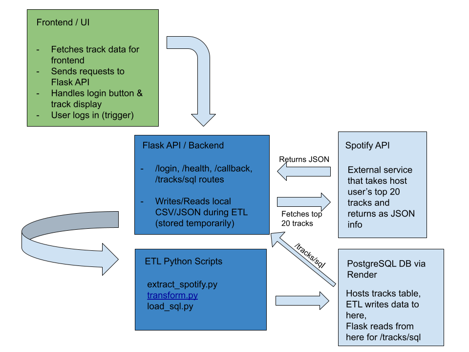
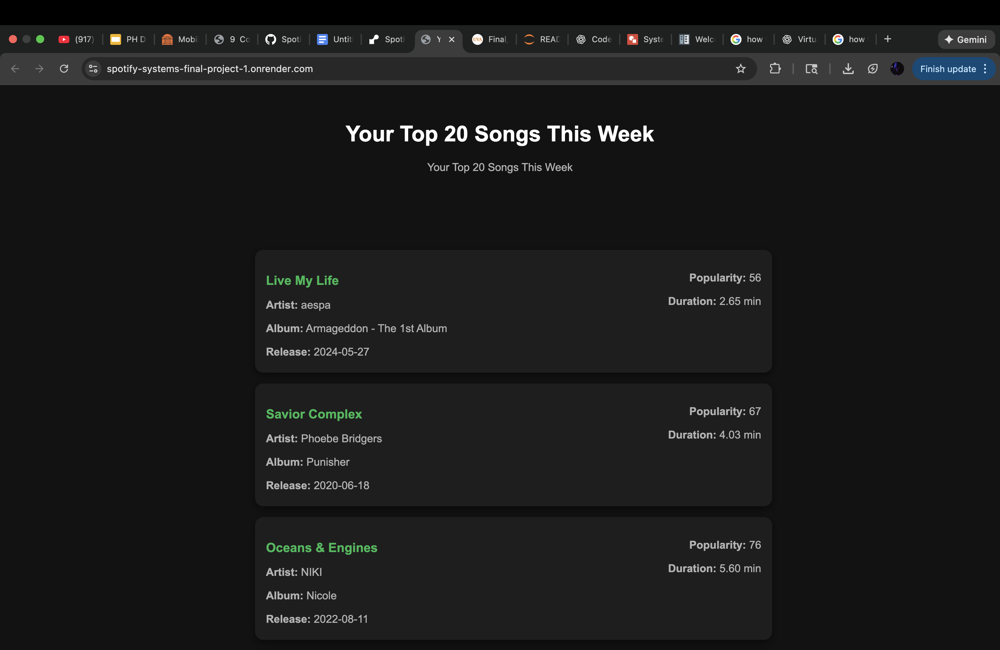

# 1. Executive Summary

### Problem: 
You work for a small music media company that wants to hop on the music data train that has boomed over the last couple of years. Websites like Receiptify and even Spotify's own Spotify Wrapped bring in huge amounts of traffic, and the company wants to provide a 24/7 service that allows users to see their top 20 songs whenever they wish.

### Solution: 
Your job will be to create a single-caching service that utilizes authorization from a single host user, a Render PostgreSQL Database, and Docker to display the host user's top 20 songs. Another employee will use what you make to integrate multi-user caching. In simpler terms, a user logs into Spotify, the server then exchanges OAuth code for the host user's token and runs a synchronous ETL process (calls Spotify API, writes JSON, converts to CSV, pushes to Render Postgres), and the frontend fetches the table from the Render Database and displays it on a Render Web App.

# 2. System Overview

### Course Concepts
- Docker
- PostgreSQL/SQL
- Flask API
- ETL Python Scripts (Data pipelines)
- APIs (Spotify API)

# 3. How To Run (Local)

### The Single Command To Run Everything
*note: set your own spotify cliend id, client secret, and redirect url via Spotify for Developers

docker-compose up --build

# 4. Design Decisions

### Why This Concept?
This concept was chosen because as a music double major I have an interest for how music and data intersect, specifically in the sociological sense. One of the initial ideas was to display the Top 50 songs in the US with Airflow support, however, this was abandoned due to the complication of the playlist name/ID constantly changing and the Spotify API preventing any access to raw data (for example, the data required to find the top 50 songs). Another idea was to use a MongoDB Database to convert the data into embedded vector representations, which would allow for a retrieval-augmented generation (RAG) model to query the data and generate personalized responses. This was abandoned due to its complex nature and existing problems with the PostgreSQL DB that would need to be fixed prior to having this high level of a project. The last concept was to have multi-user caching, but this proved to be difficult to code in the backend. This concept was chosen because it is simpler than the others and opens the door for me to continue on the track to integrate music with data science.

#### Tradeoffs
There are many, many tradeoffs and consequences to this project. This section will by formatted by file/script, with other larger considerations at the bottom.

#### api.py:
- ETL runs within the flask api, which if it takes too long, could make the browser wait and present inefficiency or have requests time out.
- No token persistence per-user (only .cache)

#### extract_spotify.py:
- raw_spotify.josn is overwritten on every run, which is safe for a single host user but not multi-users or concurrent users.

#### transform.py
- Currently assumes a flawless JSON, with simple and transformations that present no step filtering. This is because fetches from the Spotify API are usually safe, however, if presented on a large scale, it is assumed that some fetches will be malformed.

#### load_sq.py, init.sql, and Database folder
- Is only used locally, was removed from the project due to Render only utilizing one Dockerfile. Once deployed, this is no longer used, but could be for other deployment services that use more than one Dockerfile or for local testing

#### Free Render Plan
- This services us deployed with the free Render plan, which runs on hopes and dreams. Thankfully, this specific project is not meant for mass-production and only has one concurrent user and one host user. For maintainability and flexible production, large revisions to the code and deployment plan need to be made.

### Security/Privacy
- The project uses environment variables (SPOTIPY_CLIENT_ID, SPOTIPY_CLIENT_SECRET, and DATABASE_URL) rather than hard-coding sensitive credentials. These are injected at runtime through Render or the local .env file, which prevents credential leakage in the code or version control.

- Since all external input originates from Spotify’s OAuth-protected API, the system avoids arbitrary user-supplied data, reducing injection risk.

- The application does not store any personally identifiable information (PII). Only non-sensitive track metadata (e.g., song name, artist, album, popularity) is saved. No usernames, emails, profile data, or account identifiers are utilized. OAuth tokens are used only temporarily during ETL and are never written to disk.

- The connection to PostgreSQL uses SQLAlchemy, which manages parameterized queries and protects against SQL injection. Write operations are confined to a controlled ETL workflow (no input forms, no free-text fields).

### Ops

Render automatically provides basic service logs, enabling debugging without additional setup.

The application is lightweight and runs synchronously, making it suitable for single-user or demo purposes. Scaling would require separating the ETL pipeline from the Flask request cycle and potentially queuing tasks to avoid blocking during OAuth callbacks.

The app overwrites the database table on each run (if_exists="replace"), stores no historical data, and performs ETL in a blocking Flask route. It also depends on Spotify API rate limits and is not optimized for concurrent users.

# 5. Results & Evaluation

### Performance Notes

The ETL for 20 tracks is extremely lightweight, only taking a couple of seconds maximum for Spotify API requests and ~miliseconds for the Python Scripts. The backend runs with minimal memory in Docker and there are no heavy computations.

### Validations / Tests Performed

smoke_test.py checks that the clean csv file exists and that the json has the correct fields when testing locally.

# 6. What's Next?

Firstly, I would love to get this application ready for multi-user caching, so that concurrent users can utilize the service. Additionally, at some point during the project, there was an effort to integrate Airflow with the current setup, but I soon realized that it was unnecessary due to the usage of tokens. However, this made me integrate the backend into the airflow folder (or maybe it was airfow folder into the backend) so that the ETL could cooperate with airflow, and for some reason I concluded that the ETL from the flask API itself. This was mentioned in the tradeoffs section, and in future variations I will aim to separate the API from the ETL process.

Once multi-user concurrency is deployed, I the next step would be to integrate the other initial ideas. These are discussed under "Why This Concept?"

# 7. Links

Github repository: https://github.com/franciscoherrera2k05-tech/Spotify-Systems-final-project

Deployed Render link: https://spotify-systems-final-project-1.onrender.com/

# 8. Licenses

This project’s code is licensed under the MIT License — see the LICENSE file for details.

All licenses are included within the packages themselves and no redistribution of their source code is performed.

Docker:
Docker is used as a runtime environment and is not distributed as part of this project.
Users running the application must comply with Docker's own licensing terms.

Spotify API:
Spotify track metadata is obtained via the Spotify Web API and is subject to the Spotify Developer Terms of Service.
No copyrighted audio, user credentials, or personal identifiable information (PII) is stored.
Only non-sensitive track metadata is used strictly for educational purposes.

PostgreSQL:
A managed PostgreSQL instance (Render) is used as a database. PostgreSQL itself is released under the PostgreSQL License, but the database server is not distributed as part of this project.

# 9. AI Assistance Statement

This project utilized ChatGPT to assist in several aspects of development:

Flask API Development: ChatGPT was used to help structure, write, and refine the backend API code.

Frontend: ChatGPT was greatly used to help structure, write, and refine all frontend files.

Debugging & Troubleshooting: ChatGPT helped identify and resolve errors across multiple project files, including Python scripts, Docker configurations, and frontend integration.

Conceptual Understanding: ChatGPT was used as an educational tool to clarify and deepen understanding of key project concepts, including, PostgreSQL integration, Docker deployment, and API authentication.

All code decisions, implementations, and final outputs were reviewed and adapted by the developer; ChatGPT was used as a supportive tool rather than an autonomous author.
